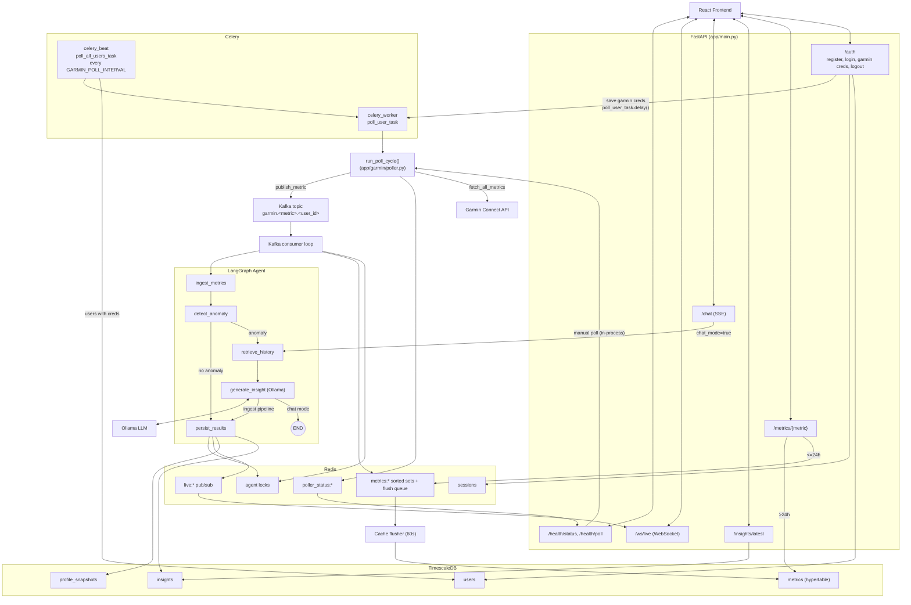

# Architecture

## Two main flows

1. **Background ingestion**: Celery Beat ticks every `GARMIN_POLL_INTERVAL` and dispatches `poll_user_task` per user. Each task fetches data from Garmin, publishes it to Kafka, and the consumer caches it in Redis and runs the LangGraph agent (anomaly detection, optional Ollama insight, persistence to TimescaleDB, and a live event over Redis pub/sub to WebSocket clients).
2. **User-facing API**: the frontend hits `/auth`, `/metrics`, `/insights`, `/chat` (SSE, runs the same LangGraph agent in chat mode against Ollama), and `/ws/live` (subscribes to the per-user pub/sub channel for real-time updates).
